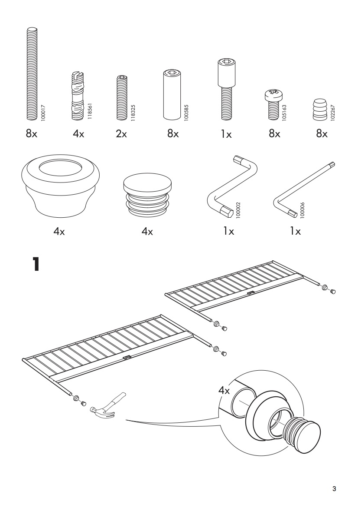

# Assembly instructions

Ideally you should be able to document the process of assembling your product in a very detailed and understandable way.

Not all people who will work on your product have the technical knowledge to understand how it works, so the assembly manual should be simple enough to allow them to complete their work.

A great example are [IKEA Assembly manuals](assets/ikea-assembly-instruction-sample.pdf)

