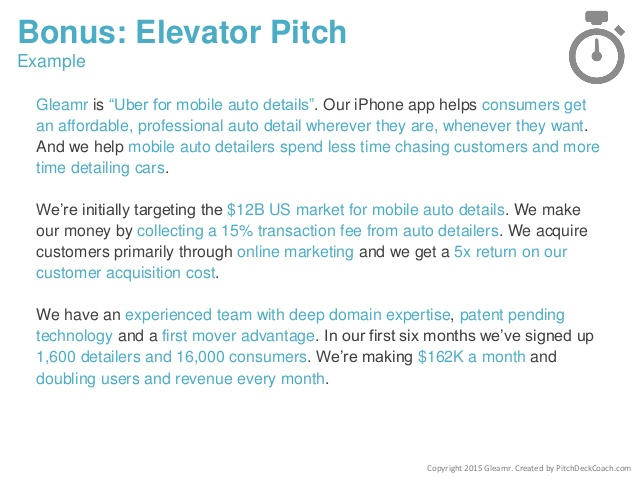

# Pitch

From Forbes:

"Your pitch will come in handy in more ways than one. You’ll use it in meetings with investors. You’ll use it when recruiting talent. You’ll use it when you tell your friends and family why they should support you in this exciting endeavor. Your pitch should be a very concise PowerPoint presentation that tells your vision for the business and the strategy you’ll use to achieve it. Refining a pitch to get it right often takes time. Once you have a solid version, it is important to continue fine-tuning it as you receive feedback from investors."

<iframe src="//www.slideshare.net/slideshow/embed_code/key/4dpBt4w6J5whJZ" width="595" height="485" frameborder="0" marginwidth="0" marginheight="0" scrolling="no" style="border:1px solid #CCC; border-width:1px; margin-bottom:5px; max-width: 100%;" allowfullscreen> </iframe> 
 <strong> <a href="//www.slideshare.net/PitchDeckCoach/airbnb-first-pitch-deck-editable" title="AirBnB Pitch Deck " target="_blank">AirBnB Pitch Deck </a> </strong> from <strong><a href="https://www.slideshare.net/PitchDeckCoach" target="_blank">PitchDeckCoach</a></strong> 

## Elevator pitch

